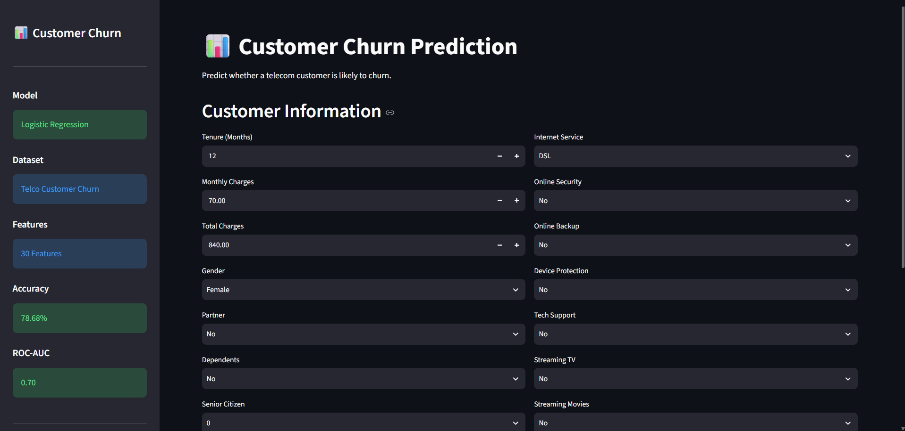
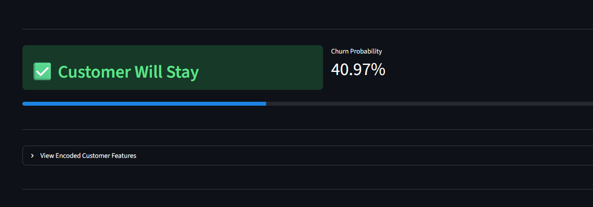
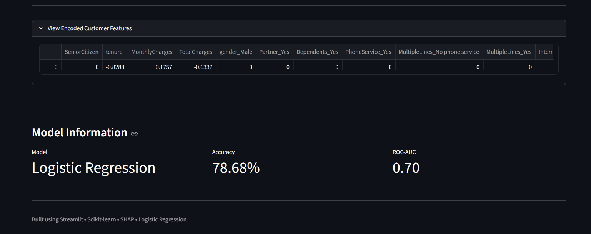

# 📊 Customer Churn Prediction

An end-to-end Machine Learning project that predicts whether a telecom customer is likely to churn using customer demographic, account, and service information. The project includes data preprocessing, exploratory data analysis (EDA), model training, model evaluation, SHAP explainability, and deployment with Streamlit.

---

## 📌 Project Overview

Customer churn prediction helps telecom companies identify customers who are likely to leave their services. By predicting churn in advance, businesses can take proactive retention measures and reduce customer loss.

---

## 📂 Dataset

- **Dataset:** Telco Customer Churn Dataset
- **Source:** IBM Sample Dataset / Kaggle
- **Target Variable:** `Churn`
- **Total Features:** 30 (after preprocessing and one-hot encoding)

---

## ✨ Features

- Data Cleaning & Preprocessing
- Exploratory Data Analysis (EDA)
- Feature Engineering
- One-Hot Encoding
- Feature Scaling
- Multiple Machine Learning Models
- Model Comparison
- SHAP Explainability
- Interactive Streamlit Web Application
- Real-time Churn Prediction

---

## 🤖 Machine Learning Models

- Logistic Regression
- Decision Tree
- Random Forest
- XGBoost

---

## 📈 Model Performance

| Model | Accuracy | ROC-AUC |
|--------|----------|---------|
| Logistic Regression | **78.68%** | **0.70** |
| Random Forest | 78.46% | 0.69 |
| XGBoost | 76.83% | 0.68 |
| Decision Tree | 72.57% | 0.66 |

**Selected Model:** Logistic Regression

---

## 🛠 Technologies Used

- Python
- Pandas
- NumPy
- Scikit-learn
- XGBoost
- SHAP
- Matplotlib
- Seaborn
- Streamlit
- Joblib

---

## 🚀 Streamlit Application

The application allows users to:

- Enter customer information
- Predict churn in real time
- View churn probability
- Display model performance
- Inspect encoded customer features

---

## 📁 Project Structure

```
Customer-Churn-Prediction/
│
├── app/
├── data/
├── models/
├── notebooks/
├── requirements.txt
└── README.md
```

---

## 📷 Screenshots

## Streamlit Dashboard



## Prediction



## SHAP Analysis



---

## 👨‍💻 Author

**Vivek Poonia**